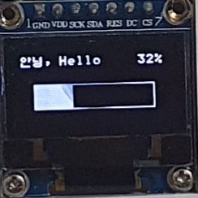

# oled-disp
This is package of oled(ssd1306) for Raspberrypi.
 - support hangul(kor) end eng. (hangul(kor): 8x8, eng : 5x8)
 - only test SPI, 128x64(ssd1306)

# Main functions
 - begin
 - clearDisplay
 - setCursor(x,y)
 - writeString(size, string, color, true) 
 - update()
 - drawBitmap()

# Example
<pre><code>
const Oled = require('oled-disp');
const oled = new Oled({ width: 128, height: 64, dcPin: 23, rstPin : 24}); // 7pin spi, rasp

oled.begin(function(){
  oled.clearDisplay();
});

// Text example (kor and eng)
oled.setCursor(1, 1);
oled.writeString(2, "안녕 Hi", 2, true);

// PNG example (128x64 png only)
pngtolcd("a.png", false, function(err, bitmap) {
  oled.buffer = bitmap;
  oled.update();
}
</code></pre>
